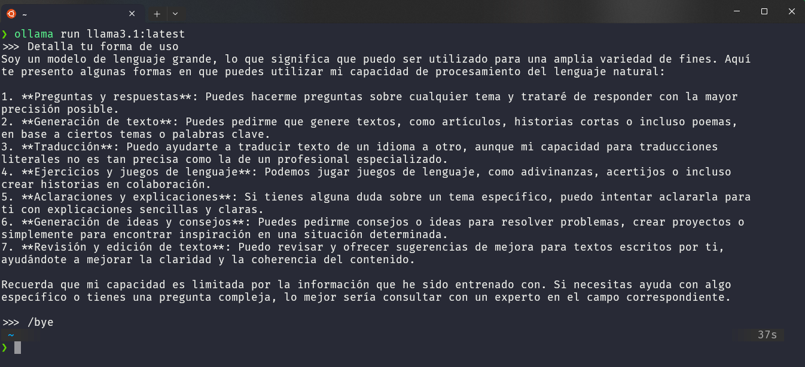

# Llama 3.1

## Probar la Aplicación
Una versión de la aplicación está desplegada y puede ser probada directamente en el navegador a través del siguiente enlace:
[Prueba la aplicación aquí](https://chat-llama3.streamlit.app/)

## Github - Ollama
- [Readme OFICIAL](https://github.com/ollama/ollama/blob/main/docs/README.md)
  
## Descarga de Ollama | Instalación.

- [Descargar ollama](https://ollama.com/download)

- Linux
    ```bash
        curl -fsSL https://ollama.com/install.sh | sh
    ```
    - [Manual install instructions](https://github.com/ollama/ollama/blob/main/docs/linux.md)


## Uso
### Selección del modelo
  - [Página para seleccionar el modelo Llama3.1](https://ollama.com/library/llama3.1)
  
    
    
    - *Seleccionar versión latest de 4.7GB para las pruebas.*

---

### Uso en consola.
```bash
ollama run llama3.1:latest
```
- *Nota: Puedes seleccionar el que quieras según necesidades y prestaciones de hardware*
  


---

### Para usarlo mediante scripts de Python.
- Descargar y configurar el modelo
```bash
ollama pull llama3.1:latest
```
```bash
pip install ollama
```
#### Ejemplo básico en Python
```python
import ollama

messages =[
    {
    'role' : 'user',
    'content': '¿<Input del usuario>?'
    },
]

response = ollama.chat(model ='llama3.1:latest', messages=messages)

print(response['message']['content'])
```

#### Ejemplo de uso en streaming con Python
```Python
import ollama

messages =[
    {
    'role' : 'user',
    'content': '¿Para qué sirve el rabo de los gatos?'
    },
]

response = ollama.chat(model ='llama3.1:latest', messages=messages)

print(response['message']['content'])
```

#### Ejemplo de chat interactivo en Python
```Python
import ollama

def chat_ollama():
    print('Chat Llama 3.1! Escribe "salir" para finalizar la conversación.')
    while True:
        user_input = input('Tu: ')
        
        if user_input.lower() == 'salir':
            print('Adios!!')
            break
    
        response = ollama.generate(model='llama3.1:latest', prompt=user_input)
        print("Bot: ", response['response'])
        
chat_ollama()
```
